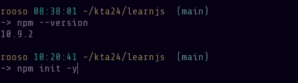

# Learnjs
! ette tuleb kohe krrektne htmle dokument
/ ees näitab et alati otsi samast kaustast style.css

css asemel oleks hea kasutatda sass
bun - teoorjas kõik mida selle tunni raames teem on võimalik teha buni peal
denao - sama
 -y yes toeverithing 

jaso failis ei saa // komentaare kasutada mul oli eal midagi välaj komenteeritud - proovisin paigaldada lisasid  webpacile 
npm error code EJSONPARSE
npm error path C:\Users\rooso\kta24\learnjs/package.json
npm error JSON.parse Expected property name or '}' in JSON at position 212 (line 7 column 5) while parsing near "...\n  \"scripts\": {\n    // \"test\": \"echo \\\"E..."
npm error JSON.parse Failed to parse JSON data.
npm error JSON.parse Note: package.json must be actual JSON, not just JavaScript.
npm error A complete log of this run can be found in: C:\Users\rooso\AppData\Local\npm-cache\_logs\2025-03-06T11_24_40_577Z-debug-0.log